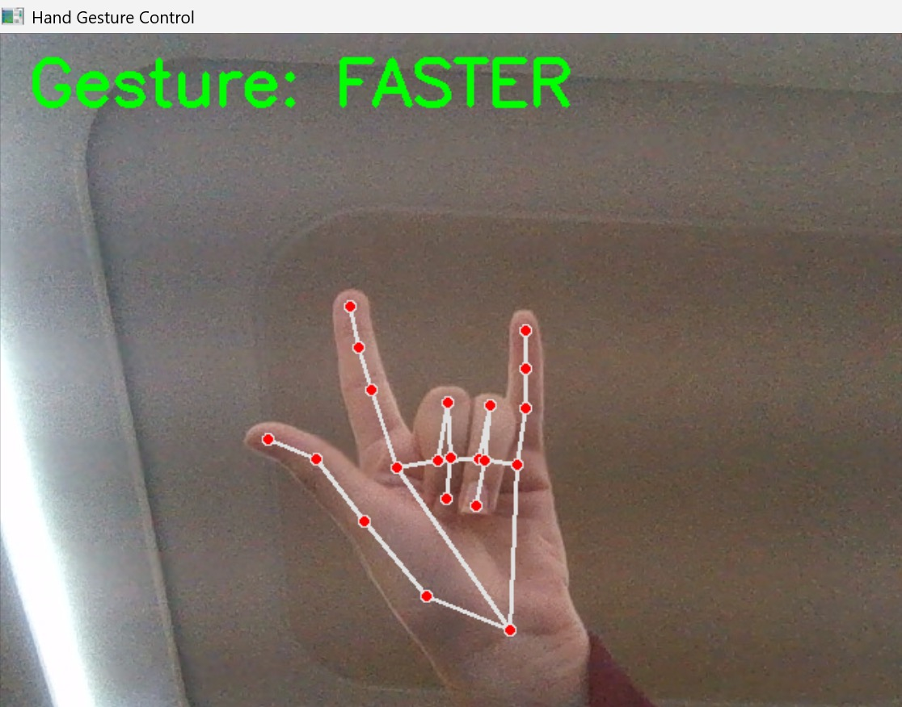
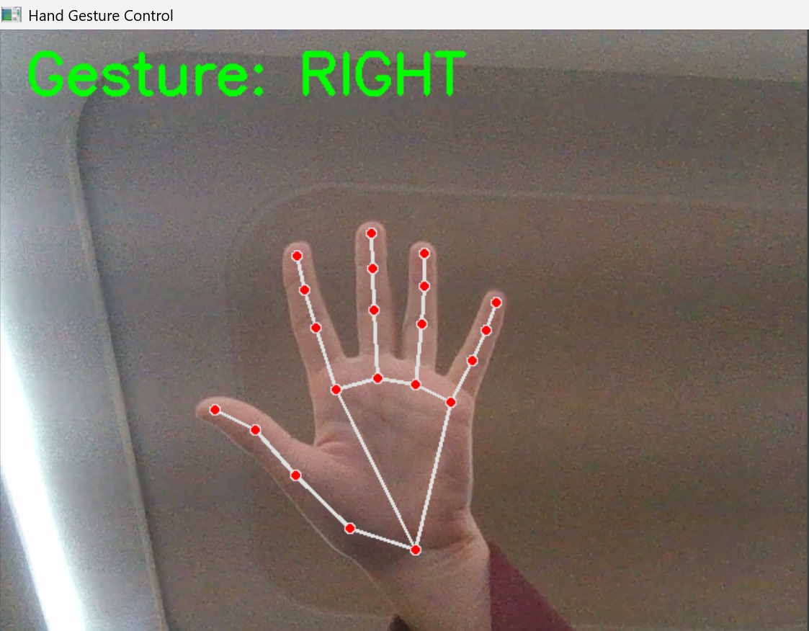
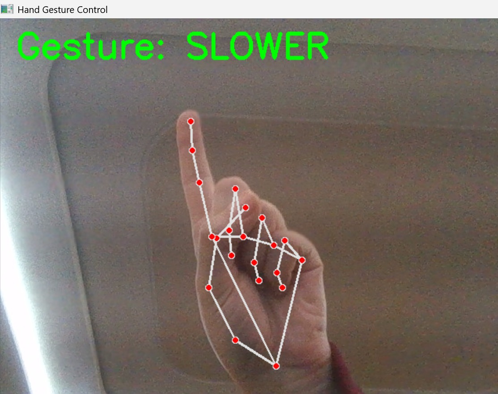
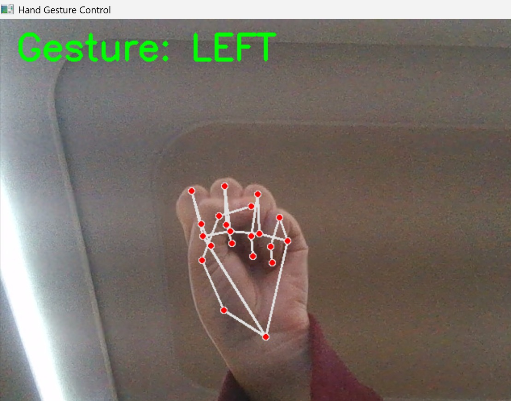

<div align="center">

# 🤖 Human-Machine Robot Interaction

### 🧠 AI-Powered Voice & Hand Gesture Control System using Computer Vision and Speech Recognition

<p align="center">
  
  
  
  
  
  
</p>

</div>

---

# 📌 Overview

This project explores advanced **Human-Machine Interaction (HMI)** techniques by combining:

- 🎤 Voice-controlled robotics
- ✋ Real-time hand gesture recognition
- 🚗 Gesture-controlled driving simulation
- 🤖 AI-powered interaction systems

The project demonstrates how **Artificial Intelligence**, **Computer Vision**, and **Speech Recognition** can create more intuitive, immersive, and natural communication between humans and machines.

---

# 🚀 Main Features

## 🎤 Voice-Controlled Robot

A virtual robot controlled using French voice commands such as:

- `avance`
- `recule`
- `stop`

### Features

✅ Speech recognition using microphone input  
✅ Voice feedback confirmation  
✅ Real-time robot control  
✅ Safety stop system  
✅ Interactive command execution  

---

## ✋ Hand Gesture Controlled Driving

A virtual highway driving simulation controlled using hand gestures detected through a webcam.

### Features

✅ Real-time hand tracking  
✅ Gesture recognition using MediaPipe  
✅ Computer vision-based interaction  
✅ Gesture-controlled acceleration and steering  
✅ Interactive gameplay simulation  

---

# 🎮 Gesture Mapping

| Gesture | Action |
|---|---|
| ✋ Open Hand | Turn Right |
| 🤘 Horn Gesture | Accelerate |
| ☝️ One Finger | Slow Down |
| ✊ Closed Hand | Turn Left |

---

# 🧰 Technologies Used

| Category | Technologies |
|---|---|
| Programming | Python |
| Computer Vision | OpenCV, MediaPipe |
| Speech Recognition | SpeechRecognition |
| Robotics Simulation | Gymnasium |
| Game Environment | highway-env |
| Audio Processing | pyttsx3, pygame |
| Real-Time Interaction | Webcam & Microphone |

---

# 📂 Project Structure

```bash
human-machine-robot-interaction/
│
├── assets/
│   └── acceleration.wav
│
├── notebooks/
│   └── human_machine_interaction.ipynb
│
├── results/
│   ├── faster_gesture.jpeg
│   ├── left_gesture.jpeg
│   ├── right_gesture.jpeg
│   └── slower_gesture.jpeg
│
├── README.md
├── requirements.txt
└── .gitignore
```

---

# ⚙️ System Workflow

<div align="center">

```text
Voice / Camera Input
          ↓
AI Recognition System
          ↓
Command Processing
          ↓
Robot / Vehicle Control
```

</div>

---

# 📸 Gesture Recognition Results

## 🚀 Accelerate Gesture

<p align="center">
  
</p>

---

## ➡️ Right Turn Gesture

<p align="center">
  
</p>

---

## 🐢 Slow Down Gesture

<p align="center">
  
</p>

---

## ⬅️ Left Turn Gesture

<p align="center">
  
</p>

---

# 🚗 Highway Driving Simulation

The system controls a virtual car in a simulated highway environment using real-time hand gestures detected by a webcam.

### Supported Controls

- Steering
- Acceleration
- Deceleration
- Interactive gameplay navigation

---

# 📦 Installation

Clone the repository:

```bash
git clone https://github.com/Souadzriouil/human-machine-robot-interaction.git
cd human-machine-robot-interaction
```

Install dependencies:

```bash
pip install -r requirements.txt
```

---

# ▶️ Run the Project

Launch Jupyter Notebook:

```bash
jupyter notebook
```

Open:

```bash
notebooks/human_machine_interaction.ipynb
```

---

# 📋 Requirements

```txt
opencv-python
mediapipe
pygame
gymnasium
SpeechRecognition
pyttsx3
numpy
jupyter
keyboard
pywin32
pyaudio
highway-env
```

---

# 🔮 Future Improvements

- Real robot implementation
- Hybrid voice + gesture interaction
- Deep Learning gesture classification
- Real-time AI assistant integration
- Autonomous driving interaction
- Multi-hand gesture recognition

---

# 👩‍💻 Author

<div align="center">

## Souad Zriouil

### AI Engineer | Data Scientist | Robotics & Computer Vision Enthusiast

<p align="center">
  <a href="https://github.com/Souadzriouil">
    
  </a>

  <a href="https://www.linkedin.com/in/souad-zriouil-54b19b267">
    
  </a>
</p>

</div>

---

<div align="center">

⭐ If you like this project, feel free to star the repository.

</div>
